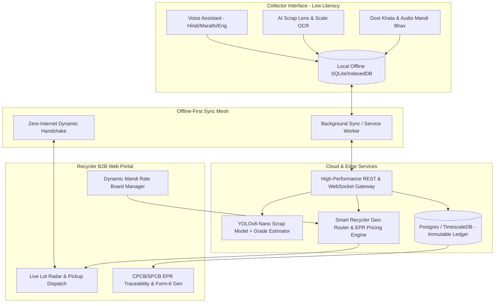

# 🌿 E-Setu (ई-सेतु / ई-मार्ग) : Informal E-Waste to Formal Recycler Bridge
> **Problem Statement Focus**: Vernacular, Low-Literacy, Offline-Tolerant Mobile Platform with AI Material Classification, Verifiable Digital Traceability, Fair Price Discovery, and Direct EPR Incentives.

---

## 🚀 1. Executive Summary & Core Philosophy

Over **90% of India's electronic waste** is collected by informal scrap dealers (*kabadiwalas*, waste-pickers, itinerant buyers) due to their unmatched last-mile reach. However, formal recyclers with state-of-the-art hydrometallurgical recovery (Lithium, Neodymium, Cobalt, Tantalum, Gold) struggle with raw material supply. Meanwhile, backyard extraction (open-air acid baths, cable burning) destroys worker health, poisons groundwater, and burns away up to 70% of critical rare-earth metals.

The barrier is **not unwillingness**, but:
1. **Informational**: No idea of real spot rates or authorized buyers.
2. **Economic**: Backyard copper extraction yields quick cash; formal recyclers have delayed paperwork and tax compliance fear.
3. **Literacy & Tech**: Complex compliance portals designed for corporates, not for a kabadiwala who cannot read English or type lengthy forms.

---

## 💡 2. Truly "Fresh & Game-Changing" Ideas (Unprecedented in Existing Solutions)

To win hackathons and create genuine field impact, we must avoid generic "e-waste directory apps". Below are **7 radical, patent-grade innovations** integrated into the solution:

### 🌟 Novelty 1: Direct "EPR Dividend" Pass-Through (The Economic Magnet)
* **The Problem**: Backyard scrap aggregators offer immediate cash. Recyclers pay standard scrap rates. Why would a kabadiwala take the hassle of going to an authorized recycler?
* **The Innovation**: Under E-Waste Rules 2022, brands (Samsung, Apple, HP) pay authorized recyclers ₹15–₹45 per kg as **EPR Compliance Certificates**. 
* **Mechanism**: Our platform enables an automated **"EPR Green Bonus"**: Recyclers pass 20–30% of their EPR certificate value *directly* to the informal collector as an instant cash/UPI bonus upon verified handover.
* **Result**: Selling formally now pays **15–20% higher than backyard burning**, making formal recycling the most profitable choice naturally!

---

### 🎙️ Novelty 2: "Bolke Lot Banao" (Voice-First Multimodal AI Agent in Hindi & Marathi)
* **The Problem**: Informal collectors cannot type complex forms, select dropdowns, or read technical e-waste terminology.
* **The Innovation**: 
  - A single big microphone button.
  - Collector speaks naturally: *"भैया 10 किलो कंप्यूटर का मदरबोर्ड और 4 इनवर्टर बैटरी है, कुर्ला में हूँ"* (Bhaiya 10kg computer motherboard and 4 inverter batteries in Kurla).
  - On-device/Edge Speech-to-Text + Local NLP extracts:
    - `materials`: `[{"category": "PCB", "sub": "Motherboard", "weight": 10, "unit": "kg"}, {"category": "Battery", "sub": "Lead-Acid/Inverter", "qty": 4}]`
    - `location`: `Kurla, Mumbai`
  - Generates the lot instantly with voice confirmation in their own dialect.

---

### 📸 Novelty 3: AI Smart Scrap Grader & Analog Scale OCR ("Kanta Parakh")
* **The Problem**: 
  1. Collectors treat all green circuit boards the same (selling high-grade RAM/telecom cards worth ₹700/kg at cheap TV board rates of ₹80/kg).
  2. Scale cheating (*dandi maarna*) by dishonest middlemen.
* **The Innovation**:
  - **PCB Tier Classifier**: Computer Vision model classifies PCB into Grade A (Gold-fingered telecom/RAM - high value), Grade B (Desktop motherboards), and Grade C (Brown CRT power supply boards), alerting the collector to the real extracted value!
  - **Scale OCR ("Kanta Parakh")**: Pointing phone camera at the mechanical hanging spring balance or electronic scale digitizer auto-captures and logs weight with cryptographic timestamp, eliminating scale disputes.

---

### 📴 Novelty 4: Sound-Wave & Dynamic QR "Zero-Internet Dual Handshake" (PORH)
* **The Problem**: Scrap godowns are often in basements, industrial slums (Dharavi, Seelampur), or remote outskirts with zero 4G network.
* **The Innovation**: **Proof-of-Responsible-Handover (PORH)**:
  - Both collector and recycler app generate an encrypted offline time-synced dynamic QR or an acoustic audio chirp (data-over-sound).
  - Both phones cross-validate offline without internet, signing the transaction cryptographically.
  - Handover receipt is stored in local SQLite/IndexedDB and synced as soon as either device hits network coverage.

---

### 📻 Novelty 5: "Daily Mandi Bhav" Spoken Audio Bulletin & Price-Alerts
* **The Problem**: Informal scrap workers don't read market charts or candlestick graphs.
* **The Innovation**:
  - Exactly like rural *Krishi Mandi* radio broadcasts, every morning at 7:30 AM, users receive a 25-second audio capsule in Marathi/Hindi:
    *🔊 "नमस्ते रामू भाई! आज तांबे वाले केबल का भाव ₹420 प्रति किलो है (₹15 की बढ़त)। लीथियम बैटरी का भाव स्थिर है। अपने नजदीकी अधिकृत रिसाइकलर को बेचें और ₹25 का अतिरिक्त ईपीआर बोनस पाएं!"*
  - Includes a physical "Audio Price Board" with high-contrast color codes (Green = rate up, Red = rate down).

---

### 🛡️ Novelty 6: Hazard-Detector & "Swachh Karma" Micro-Insurance Pool
* **The Problem**: Collectors often smash CRTs (inhaling lethal phosphor/lead) or puncture lithium pouches causing warehouse fires.
* **The Innovation**:
  - Camera detects cracked CRT envelopes or swollen lithium batteries and triggers an instant vernacular voice alert: 
    *⚠️ "रुकिए! इस कांच को मत तोड़िए, इसमें जहरीला लेड है। पूरा सुरक्षित जमा करने पर ₹50 एक्स्ट्रा मिलेंगे!"*
  - **Swachh Karma Score**: Handing over hazardous material intact earns karma points funded by Recycler CSR/EPR pools, unlocking free micro-health insurance (OPD cover for cuts/burns) or safety kit dispensers (puncture-proof gloves, goggles).

---

### 📒 Novelty 7: "Dost Khata" (Cash-First Ledger with Zero Tax Harassment)
* **The Problem**: Fear of formal banking, fear of GST/Income Tax notices makes collectors run away from digital systems.
* **The Innovation**:
  - Fully supports **Cash Handover** as a 1st-class citizen! The collector can choose "Received Cash" or "Instant UPI".
  - The system creates a private, stamp-verified "Proof of Legitimate Collection" card that protects the scrap dealer from police harassment during inter-city scrap transport.

---

## 🏗️ 3. End-to-End System Architecture

---

## 📊 4. Structured Datasets Specification

The platform is designed around 7 rigorously normalized and verifiable datasets:

| Dataset Name | Primary Keys | Core Fields & Attributes | Verification / ML Use |
| :--- | :--- | :--- | :--- |
| **1. Material Dataset** | `material_id`, `category_code` | Category (PCB, CRT, Li-ion, Cables, Motors, Mixed Plastics), Sub-category (Tier-1 Motherboard, RAM stick, Pouch Cell, Copper Wire 70%), Visual Embeddings, Average Density (g/cm³), Hazardous Flag, Safe Handling Audio URI | Trains scrap classifier & volumetric estimator |
| **2. Price Dataset** | `price_id`, `material_id`, `mandi_geo_zone` | Base scrap buying rate, EPR Green Bonus, Daily Min/Max spread, Spot Date, Unit (kg/pc), Trend Indicator (+/- %), Source Recycler ID | Historical price trends, price anomaly detection |
| **3. Recycler Dataset** | `recycler_id`, `cpcb_reg_no` | Facility Name, GPS Geofence, SPCB/CPCB valid date, Accepted Materials List, Minimum Lot Weight Threshold, Pickup Fleet Availability (Yes/No), Quoted Premium | Proximity-matching algorithm, regulatory verification |
| **4. Transaction Dataset** | `transaction_id`, `lot_id` | Collector ID, Recycler ID, Material, Scale Verified Weight, Rate/kg, EPR Bonus, Total Amount, Payment Mode (Cash/UPI), Geo-coords, Timestamp | Tax-compliant Form 6 & informal financial scoring |
| **5. Traceability Dataset (PORH)**| `trace_id`, `lot_id` | SHA256 Photo Hash, Scale Photo, Dual-Party Dynamic Nonce, GPS Lat/Long, Timestamp, Recycler Digital Stamp, Chain of Custody State | Anti-fraud CPCB audit compliance |
| **6. Collector Profile Dataset** | `collector_id` (Anonymous UUID) | Operating Zone, Language Preference (mr/hi/en), Preferred Payment Mode, Swachh Karma Score, Badges, Total Safe Tonnage Handed | Zero PII intrusion; builds credit-readiness record |
| **7. AI Training & Validation** | `sample_id`, `image_path` | Bounding Boxes, Segmentation Masks, Material Class, Illumination Condition, Real vs Inferred Weight, User Correction Feedback | Continuous Edge active-learning loop |

---

## 💰 5. Unit Economics & Sustained Viability Assessment

### Comparison: Backyard Smelting vs. Formal E-Setu Platform
*(Based on a 50kg lot of Mixed Computer Scrap: 20kg Motherboards, 15kg Cables, 15kg SMPS/Plastics)*

| Parameter | Backyard / Unorganized Middleman | Via E-Setu Formal Channel | Benefit to Collector |
| :--- | :--- | :--- | :--- |
| **Base Material Realization** | ₹4,800 (Middleman cuts margins) | ₹5,600 (Direct transparent Mandi rate) | **+ ₹800** |
| **Weight Fraud Risk** | -5% to -10% lost in rigged scale | 0% (Scale OCR + Recycler certified scale) | **+ ₹350** |
| **EPR Green Bonus** | ₹0 (Zero formal recognition) | ₹650 (EPR bonus shared by brand/recycler) | **+ ₹650** |
| **Health Cost Deductions** | Acid burns, smoke inhalation | Free N95/Gloves + Zero exposure | **Priceless** |
| **Net In-Pocket to Collector** | **₹4,400 - ₹4,600** | **₹6,600** | **+35% to +45% More Cash!** |

### Platform Sustainability (How it Funds Itself)
1. **Recycler EPR Commission**: 1.5% fee on verified EPR certificates unlocked through our chain-of-custody data (Brands pay recyclers ₹25/kg; platform takes ₹0.40/kg).
2. **Reverse Logistics Optimization**: Grouping 10 small collector lots in the same neighborhood allows recyclers to run a single mini-truck pickup route, saving 40% in fuel costs.
3. **Hardware-Free Operation**: Zero hardware cost; works on existing smartphones of collectors and recyclers.
